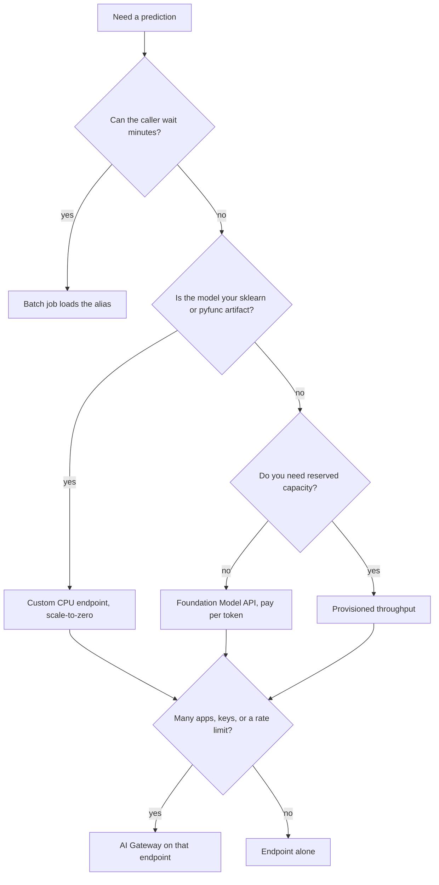

# AI Gateway, models, and serving endpoints

Which Databricks object to use, and when. This repo serves a small scikit-learn model. Most of the rows below are the decision, not a resource this repo creates.

The readiness scores that use this decision are in [docs/checks](../checks/databricks-mlops-ready.md).

## Four different things

People mix these up because the UI shows all of them near "Serving".

| Object | What it is | What it is not |
|---|---|---|
| Unity Catalog model | The versioned artifact: files, signature, pip pins, alias. | A URL. Nothing calls it until a job or an endpoint loads it. |
| Batch job | A Lakeflow job that loads `models:/catalog.schema.model@alias` and writes rows. | An HTTP API. Latency can be minutes. |
| Model Serving endpoint | A named URL that loads one or more model versions and returns a prediction. | The model itself. Deleting the endpoint does not delete the Unity Catalog version. |
| AI Gateway | A policy in front of an endpoint: who can call it, how fast, what gets logged, which endpoint is the fallback. | A model, and not a cheaper way to host one. The endpoint behind it still bills. |

Put the model in Unity Catalog first. Then choose batch, an endpoint, or both. Add a gateway only when several callers share that endpoint and you need limits or logs.

## Decision



| You need | Use | Do not use |
|---|---|---|
| A reviewed artifact and an alias (`@develop`, `@ppe`, `@prod`, `Champion`) | Unity Catalog registered model | Workspace Model Registry stages. Those stages do not exist for Unity Catalog models. |
| Scores for a table, a dashboard, or a nightly file | Batch job. This repo's infer task is the small version of that. | An endpoint that stays warm between calls. |
| One row back in the request, your own model | Custom Model Serving, CPU, Small, scale-to-zero | A GPU endpoint, or a second web service you run yourself |
| A hosted LLM (Llama, GPT, Claude) and you pay per token | Foundation Model API, pay-per-token | Provisioned throughput while you are still testing prompts |
| A guaranteed tokens-per-second floor for an LLM | Provisioned throughput | Pay-per-token, once timeouts under load are the actual problem |
| An OpenAI or other SaaS model, but Databricks holds the key and the URL | External model endpoint | The vendor key in the application |
| Rate limits, caller keys, usage tables, fallbacks, guardrails | AI Gateway on the endpoint you already chose | A gateway with no endpoint behind it |
| This iris classifier | Unity Catalog model + batch infer + one CPU endpoint per environment | AI Gateway, Foundation Model API, provisioned throughput |

## Unity Catalog model

Use it when the thing you trained must be named, versioned, and loaded by more than one job.

This repo:

- Name: `dbw_iris_ml_dev.<env>.iris_species`
- Train logs one pyfunc with a signature, an input example, and `requirements-serving.txt`
- Aliases: the env name and `Champion`
- Version tags: `code_version`, `accuracy`, `env`, and `git_sha` when the runner has a SHA

Load it as `models:/dbw_iris_ml_dev.develop.iris_species@develop`. Do not copy `models/iris_species` from git into the workspace and call that production. The git folder is for laptop tests.

## Batch scoring

Use a job when the caller is a table or a person who can wait.

Use an endpoint when a user action needs the row now (a form, a checkout, a support tool).

This repo's infer task scores two known rows and fails the job if the species is wrong. That is a gate, not a gold predictions table. A fuller batch path writes Delta and lets dashboards read the table. The model is not called from the dashboard.

Batch is the cheaper default. It spends serverless job time only while it runs.

## Custom Model Serving endpoint

Use this for the iris model. The caller POSTs one or a few rows and needs the species back.

Shape in this repo, applied by `scripts/apply_served_version.py` during gated CD:

- Name: `develop-iris-species`, `ppe-iris-species`, or `prod-iris-species`
- One served entity, the Unity Catalog model
- `entity_version` is the version the env alias points at **after the train job in that same CD run**
- Workload CPU, size Small
- `scale_to_zero_enabled: true`
- No `auto_capture_config` (the legacy field is rejected, and payload logging is a cost line)

Scale-to-zero means idle is about $0 per hour. A request wakes a Small CPU endpoint. That wake can take minutes the first time, then the endpoint stays warm until it has been idle for about 30 minutes. A live POST resets that timer. Use `scripts/test_serving.py --dry-run` when you are only checking the payload.

CD does two different things:

1. Missing endpoint: `serving-endpoints create --no-wait`
2. Endpoint exists and the alias moved: `serving-endpoints update-config --no-wait`

`--no-wait` returns before the container is ready. The following `serving-endpoints get` shows `NOT_READY` until the update finishes. A train that moves the alias does nothing to HTTP serving until this CD step runs. That is deliberate. The endpoint does not follow "latest", and it does not stay on the version from the day it was created.

Traffic split (two versions, 10% and 90%) is how you canary. This repo sends 100% to the alias version. Add a split only when you have a reason to serve two versions at once.

## Foundation Model APIs

Use pay-per-token when you want a hosted LLM and you do not want to manage GPUs. Databricks already runs those models. You create an endpoint that routes to one, or you call the pre-provisioned endpoint.

Use it for chat, extraction, or classification **when the model is an LLM you do not train**. Do not wrap the iris forest in a Foundation Model endpoint. The forest is a custom model.

Pay-per-token is the right first LLM bill: you pay for tokens, not for a GPU that sits idle. It is the wrong bill when you need a latency guarantee under load.

## Provisioned throughput

Use it when an LLM endpoint must hold a tokens-per-second floor, and pay-per-token timeouts are already the problem. You reserve capacity. You pay for that reservation even when traffic is quiet.

Do not start here. It is the expensive form of the same Foundation Model.

## External models

Use an external-model endpoint when the model stays at another vendor and you still want Databricks auth, the AI Gateway, and one URL for the app. The vendor key belongs in a Databricks secret, not in the app repo.

This project has no vendor LLM key and does not create one.

## AI Gateway

The gateway is a configuration on a serving endpoint. It does not host the model. Turn it on when the endpoint already exists and at least one of these is true:

| Gateway control | Turn it on when | Leave it off when |
|---|---|---|
| Rate limits | More than one app calls the endpoint, or one caller can run up the bill | The only caller is this repo's dry-run, and the cap is $10 |
| Usage tracking | You need to see which key called the endpoint | The cost tracker and the job run list are enough |
| Inference tables | You will debug bad rows or measure drift, and the cost sheet lists payload GB | You have not priced the table. Iris rows are small; the line item is still real. |
| Guardrails | The payload is free text to an LLM (PII, topics, safety) | The payload is four numeric iris measurements |
| Fallbacks | A second endpoint should take traffic when the first fails | You have one Small CPU entity and no second model |

Query the endpoint the same way whether or not the gateway is on. The app still POSTs to `/serving-endpoints/<name>/invocations`. The gateway changes limits and logging, not the model signature.

### What this repo does

The iris endpoint does **not** enable the AI Gateway. The payload is four numbers, there is one caller, and inference-table capture is a billed feature that the cost sheet has not approved. The guide exists so the next model (especially an LLM) does not turn the gateway on by habit, and does not skip it when several apps share a key.

MLflow tracing on the train run is a single holdout span so the run shows the score step. That span is not an AI Gateway trace, and it is not a per-request log of the endpoint. Per-request traces and gateway usage tables are the LLM path. They are slower and they cost more than this forest needs.

### A later LLM, in order

1. Keep the classical model on the CPU endpoint.
2. If you add an LLM, start with pay-per-token.
3. Put the AI Gateway on that LLM endpoint when a second caller or a rate limit appears.
4. Move to provisioned throughput only after pay-per-token misses a real latency target.
5. Add each of those to `docs/cost-tracker.md` before CD creates them.

## What stays off under the $10 cap

- AI Gateway usage tracking and inference tables
- Foundation Model pay-per-token
- Provisioned throughput
- A GPU workload size
- A second endpoint beside `develop-iris-species`, `ppe-iris-species`, and `prod-iris-species`
- Lakehouse Monitoring

## Checks that do not spend money

```bash
databricks bundle validate -t develop
python scripts/test_serving.py --endpoint develop-iris-species --dry-run
```

`serving-endpoints get` and a live POST are not free of side effects: the get is a read, the POST wakes the endpoint. Gated CD is the path that creates or updates the endpoint.
