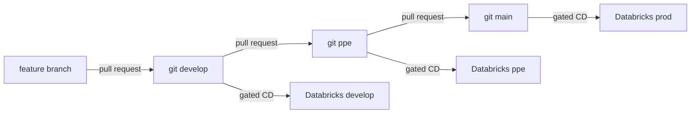

# Code movement, ELI25

You already have three git branches and three Databricks environments.
This page is the walk from a change on your laptop to the prod endpoint,
one door at a time.

People say "dev". In this repo that door is named **`develop`** on both
sides: the git branch and the Databricks target. There is no branch called
`dev`, and there is no branch called `prod`.

**`main` is the prod git branch.** The Databricks environment it deploys is
named `prod`.

The short path:

`feature/<short-name>` → `develop` → `ppe` → `main`

Each arrow is a pull request. A feature branch never deploys.

The same pairs are in code: [`src/iris_model/promotion.py`](../../src/iris_model/promotion.py).
CD refuses a deploy when the branch and the Databricks target disagree.

## What actually moves

The thing that moves is the **git commit**: the training code, the job YAML,
and the bundle. Each environment then trains its own model into its own
Unity Catalog schema. The model file is not copied from develop into prod.

| You are here | Git branch | Databricks target | Endpoint | Unity Catalog model |
|---|---|---|---|---|
| Integration ("dev") | `develop` | `develop` | `iris-species-develop` | `dbw_iris_ml_dev.develop.iris_species` |
| Pre-production | `ppe` | `ppe` | `iris-species-ppe` | `dbw_iris_ml_dev.ppe.iris_species` |
| Production | `main` | `prod` | `iris-species-prod` | `dbw_iris_ml_dev.prod.iris_species` |

They share one Databricks workspace host today. The prefix on every name
keeps the three environments from overwriting each other. A later split
onto separate hosts is the
[promotion runbook](../runbooks/promote-ppe-prod-and-uae.md). The git path
stays the same.

Azure DevOps uses a matching approval environment and variable group:
`iris-develop`, `iris-ppe`, and `iris-prod`.

## Picture

CI runs on the pull request and again after the merge. CI runs tests and
`databricks bundle validate`. CI never deploys.

CD is [`azure-pipelines-cd.yml`](../../azure-pipelines-cd.yml). You start it
by hand, and only after [`docs/cost-tracker.md`](../cost-tracker.md) is
approved. It looks at the branch you started it from and deploys only that
branch's Databricks target, as that environment's service principal.
Who those accounts are: [eli25-identities.md](eli25-identities.md).

## The steps

### 1. Change the code on a feature branch

Cut `feature/<short-name>` from `develop`. Commit the training change, the
tests, and any bundle edit there. Do not deploy from this branch.

### 2. Open a pull request into develop

The target branch is `develop`. Azure DevOps CI
([`azure-pipelines.yml`](../../azure-pipelines.yml)) runs pytest, ruff, and
`databricks bundle validate` for `develop`, `ppe`, and `prod`. A red check
means do not merge. Validate reads the YAML. It does not create jobs or
endpoints.

### 3. Merge into develop

`develop` now has the commit. CI runs again on the push. Still no deploy.

### 4. Deploy the develop Databricks environment

When the cost tracker is approved, run `azure-pipelines-cd.yml` with the
source branch set to `develop` and type `YES` in the confirm parameter. A
run from any other branch fails before validate.

That run:

1. Validates all three bundle targets. Validate does not spend.
2. Asks the `iris-develop` environment for approval.
3. Runs `scripts/assert_deploy_branch.py --target develop`. If the branch
   is not `develop`, the deploy stops before any workspace change.
4. Runs `databricks bundle deploy -t develop`.
5. Starts `iris-ml-train-develop`, then `iris-ml-infer-develop`, only when
   `runMode` is `train-and-serve`. The default `serve` does not start either
   job. Use `train-and-serve` when this environment should register its own
   model version and score it.
6. Points endpoint `iris-species-develop` at Unity Catalog alias `@develop`.
7. Dry-runs the serving check. A live POST is a separate step and can wake
   the endpoint. See [serving-inference-test.md](../serving-inference-test.md).

The ppe and prod stages are skipped on this run because the source branch
is not `ppe` or `main`.

### 5. Promote develop into ppe

When develop scores look right, open a pull request **from `develop` into
`ppe`**. CI runs again. Merge.

Run the same gated CD pipeline with the source branch set to `ppe`. Only
the ppe stage runs. It deploys Databricks target `ppe`, trains into
`dbw_iris_ml_dev.ppe.iris_species`, and serves `iris-species-ppe`.

### 6. Promote ppe into main

When ppe looks right, open a pull request **from `ppe` into `main`**. That
merge is the production release.

Run gated CD with the source branch set to `main`. The prod stage deploys
Databricks target `prod`. The endpoint is `iris-species-prod`. The model is
`dbw_iris_ml_dev.prod.iris_species`.

## What the code checks

| Piece | What it locks |
|---|---|
| `src/iris_model/promotion.py` | The three rows in the table above |
| `databricks/targets/develop.yml` | `git_branch: develop` |
| `databricks/targets/ppe.yml` | `git_branch: ppe` |
| `databricks/targets/prod.yml` | `git_branch: main` |
| `scripts/assert_deploy_branch.py` | CD stops if the branch does not match the target |
| `azure-pipelines-cd.yml` | develop stage only on `develop`, ppe only on `ppe`, prod only on `main` |

A develop deploy started from `ppe`, or a prod deploy started from
`develop`, exits before `bundle deploy`.

GitHub Actions `cd.yml` contains the same check and stays disabled
(`if: false`). Azure DevOps is the pipeline that deploys.

## What you do not do

- Do not force-push `develop`, `ppe`, or `main`.
- Do not open a feature pull request into `ppe` or `main`. Features merge
  only into `develop`.
- Do not deploy because CI went green. Deploy is the manual CD pipeline,
  and it stays off until the cost tracker is approved.
- Do not copy a model version from the develop schema into prod. Each
  environment refits from the same commit.
- Do not rename the prod git branch to `prod`. The branch is `main`. The
  Databricks target is `prod`.

## If a deploy is wrong

Check out the last good commit on that git branch and redeploy the same
Databricks target. Commands and the later step of giving ppe or prod its
own workspace host are in the
[promotion runbook](../runbooks/promote-ppe-prod-and-uae.md).

## Related

- [Branch rules](../branch-rules.md)
- [Jobs and serving](eli25-jobs-and-serving.md)
- [Azure DevOps](azure-devops.md)
- [Where to put variables](where-to-put-variables.md)
