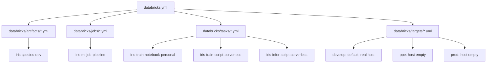
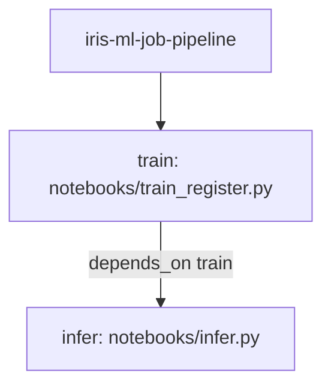
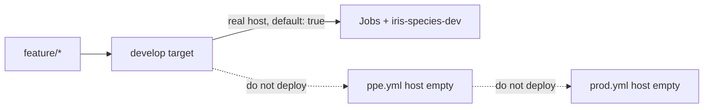
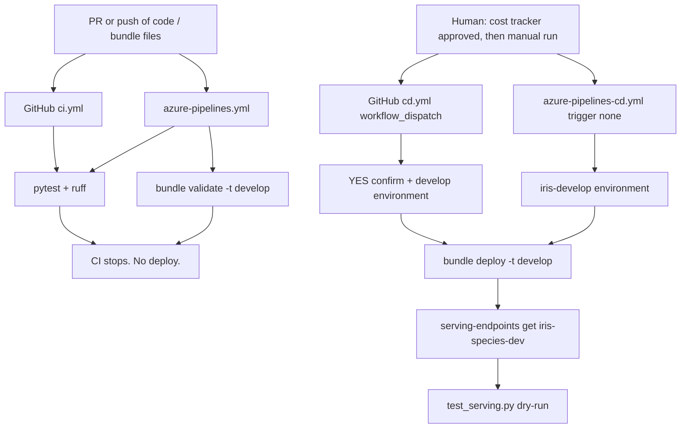

# Databricks productionalisation, ELI25

You have a working local iris model in `models/iris_species`.
**Productionalisation** here means: describe the Databricks resources in git,
validate that description for free, and only then (after a written cost
approval) create one cheap develop path.

This is not "stand up three environments and an always-on cluster." That is
how the bill becomes a surprise. The working agreement is develop-only
serving, a **$10 / month** cap, and teardown back to $0.
See [cost tracker](../cost-tracker.md) and
[ADR-001](../decisions/ADR-001-develop-only-serving-path.md).

The lifecycle story is [ELI25: MLOps lifecycle](eli25-mlops-lifecycle.md).
Job and endpoint names are [ELI25: Jobs and serving](eli25-jobs-and-serving.md).

## The move, in one sentence

Laptop artifact → Unity Catalog version → Asset Bundle (jobs + one endpoint) →
gated `bundle deploy -t develop` → `iris-species-dev` with scale-to-zero.

Nothing in this repository creates Azure resources by itself. `bundle deploy`
also does not create the resource group or the workspace. Those are a
separate, approved setup step. The bundle only fills a workspace that
already exists.

## Bundle layout

A **Databricks Asset Bundle** (DAB) is the packing list for the workspace:
jobs, the serving endpoint, and which target you are talking to. Official
docs: [Asset Bundles](https://learn.microsoft.com/en-us/azure/databricks/dev-tools/bundles/).
Repo how-to: [databricks-asset-bundles.md](databricks-asset-bundles.md).



`databricks.yml` holds only `bundle.name` (`iris-ml-prod-test`), variables,
and `include`. It does not define the jobs or the endpoint inline.

| Variable | Default | Role |
|---|---|---|
| `personal_compute_id` | `""` | Existing personal-compute ID, passed with `--var` at deploy/run time |
| `registered_model_name` | `dbw_iris_ml_dev.develop.iris_species` | Unity Catalog model |
| `experiment_name` | `iris-species` | MLflow experiment (script may prefix `/Users/<you>/`) |
| `owner` | `iris-learn` | Tag only. Not auth. |

Includes:

- `databricks/artifacts/*.yml`
- `databricks/jobs/*.yml`
- `databricks/targets/*.yml`
- `databricks/tasks/*.yml`

**DAB cannot split the same job key across files.** That is why
`databricks/tasks/*.yml` each contain one *complete* job, not a fragment of
`iris-ml-job-pipeline`. The pipeline is its own complete job in
`databricks/jobs/iris_ml_job_pipeline.yml`.

Notebooks stay in `notebooks/`. The bundle points at them; it does not copy
them under `databricks/`.

## Commands that are safe vs paid

From the repo root, after the Databricks CLI is installed and you have
authenticated as a user (service-principal secrets stay in the
`iris-develop` variable group, never in git — [secrets](../secrets.md)):

```bash
databricks bundle validate -t develop
```

```bash
# Paid. Do not run until the cost sheet / $10 budget is approved.
databricks bundle deploy -t develop
```

Do not run `-t ppe` or `-t prod`. An empty host should fail, and that is
what we want.

`bundle deploy` creates or updates workspace resources from the YAML. It is
how the four jobs and `iris-species-dev` show up together.

## Jobs: four names, one pipeline graph

Standalone jobs (run one thing):

| Job | Compute | Source |
|---|---|---|
| `iris-train-notebook-personal` | Personal cluster via `personal_compute_id` | `notebooks/01_train_and_register.ipynb` |
| `iris-train-script-serverless` | Serverless | `notebooks/train_register.py --register` |
| `iris-infer-script-serverless` | Serverless | `notebooks/infer.py` against the UC model |

The chained job:



`infer` does not start if `train` fails. Infer uses
`models:/${var.registered_model_name}` (latest UC version after the train
task registers). Serving stays pinned at version 5 until you bump YAML.

Serverless jobs install `requirements-serving.txt`. No all-purpose cluster
and no SQL warehouse are in this bundle. That is the "forgotten cluster"
failure mode this project refuses.

Names and tags: [Jobs and serving](eli25-jobs-and-serving.md).

## Serving without burning money

`databricks/artifacts/iris_endpoint.yml` declares **one** endpoint:

- Name: `iris-species-dev`
- Entity: `iris_species` → `dbw_iris_ml_dev.develop.iris_species` version **5**
- `workload_type: CPU`, `workload_size: Small`
- `scale_to_zero_enabled: true`
- no `auto_capture_config` (legacy inference tables are rejected on create)

**Scale-to-zero** is the shop pulling shutters after ~30 idle minutes. A warm
Small CPU endpoint can bill up to 4 DBU per hour (1 DBU/h per concurrent
slot, Small allows 4). Idle is ~$0/h. Every live POST resets that idle
clock. Batch your checks. Sources stay in
[databricks-asset-bundles.md](databricks-asset-bundles.md).

Auto-capture is off so serving does not write an inference table (payload GB
is a real DBU line). If you turn it on later, put it on the cost sheet first.

Do not add a second endpoint in this repo. `ppe` / `prod` endpoint names are
runbook fiction until those hosts are filled.

## Unity Catalog

Unity Catalog is the shared pantry: `catalog.schema.model`.

This project's registered name is `dbw_iris_ml_dev.develop.iris_species`.
Jobs register new versions there. The endpoint serves version 5 until
`entity_version` changes.

The checked-in folder `models/iris_species` is a different copy, used by
local pytest and `python -m iris_model.score`. Registering on Databricks
does not overwrite git.

## Targets: develop now, ppe/prod later



- `databricks/targets/develop.yml`: `mode: production`, `default: true`,
  real workspace host, `root_path` under `/Shared/.bundle/...`.
- `databricks/targets/ppe.yml` and `prod.yml`: same shape, `host: ""`.

Git branches `develop` / `ppe` / `prod` match those target names.
`develop` is the only branch that will deploy, and only after cost approval.
[Branch rules](../branch-rules.md).
When you actually want a second environment:
[promote-ppe-prod-and-uae.md](../runbooks/promote-ppe-prod-and-uae.md).
UAE North is a **new** workspace (region is not editable).

## CI vs CD

CI answers "did we break the model or the YAML?" CD answers "should we spend
money in develop?" Those are different files on purpose.



| Path | Files | What it does | Deploy? |
|---|---|---|---|
| CI | `.github/workflows/ci.yml` | pytest + ruff, path filter, concurrency cancel | Never |
| CI | `azure-pipelines.yml` | pytest + ruff + `bundle validate -t develop` | Never |
| CD | `.github/workflows/cd.yml` | `workflow_dispatch`, type `YES`, `develop` environment | develop only |
| CD | `azure-pipelines-cd.yml` | `trigger: none`, `pr: none`, `iris-develop` environment | develop only |

GitHub CI does not run `bundle validate` (no Databricks auth on that
workflow). Azure CI does, using the `iris-develop` variable group for
`DATABRICKS_HOST` / `DATABRICKS_TOKEN`.

CD's smoke step is `--dry-run` (payload shape, no live spend). A real POST
is a separate, conscious act: [serving-inference-test.md](../serving-inference-test.md).

Do not create or dispatch either CD pipeline until
[cost-tracker.md](../cost-tracker.md) is approved and the $10 budget exists.
Wiring the Azure project: [azure-devops.md](azure-devops.md).

## $10 cap, then teardown

Cap math lives in the cost tracker: a warm Small endpoint at the East US
rate, sized so ~35 active hours stays under **$10 / month**. Alerts at 50 /
80 / 100%. If you would blow 35 warm hours, stop the endpoint instead of
raising the cap.

Shutdown order is disable-first, delete-last:
[teardown-and-restore.md](../teardown-and-restore.md).

1. Backup endpoint config if the workspace is still there.
2. Stop / delete `iris-species-dev` (serving has no pause; the bundle
   recreates it).
3. Disable CI; leave CD uncreated / undispatched.
4. Delete `rg-iris-ml-dev` only with an extra confirm flag.

Restore is the reverse: approved setup + budget, `bundle deploy -t develop`,
re-enable CI, one serving check, stamp the cost snapshot.

## What you do not do yet

- Do not `bundle deploy` or `bundle run` as part of reading this page.
- Do not fill `ppe.yml` / `prod.yml` hosts "to see what happens."
- Do not add a second serving endpoint or an always-on cluster.
- Do not put tokens in YAML, guides, or chat. Names of scopes and variable
  groups are fine; values are not.
- Do not treat CD `--dry-run` as proof the live endpoint scored a flower.

## Related

- [Productionalisation checklist](../productionalisation/README.md) (folders, files, workflows, rules, markdown)
- [ELI25: MLOps lifecycle](eli25-mlops-lifecycle.md)
- [ELI25: Jobs and serving](eli25-jobs-and-serving.md)
- [Databricks Asset Bundles](databricks-asset-bundles.md)
- [Azure DevOps](azure-devops.md)
- [Promotion and UAE runbook](../runbooks/promote-ppe-prod-and-uae.md)
- [Cost tracker](../cost-tracker.md)
- [Teardown and restore](../teardown-and-restore.md)
