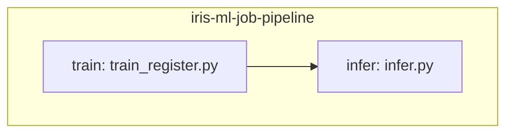

# Jobs and serving, ELI25

Short inventory of what the bundle actually declares. Lifecycle:
[eli25-mlops-lifecycle.md](eli25-mlops-lifecycle.md). How it gets to
Databricks without a surprise bill:
[eli25-databricks-productionalisation.md](eli25-databricks-productionalisation.md).

There is **one job** per environment and **one** serving endpoint. No extra
clusters. Standalone train and infer jobs were removed because they never
ran. The notebook `notebooks/01_train_and_register.ipynb` stays in git for
interactive use. It is not a deployed job.

## The pipeline job

| Job name | File | Compute | What it runs |
|---|---|---|---|
| `iris-ml-job-pipeline` | `databricks/jobs/iris_ml_job_pipeline.yml` | Serverless | `train` then `infer` (`infer` `depends_on` `train`) |

Deployed names are `${var.env_prefix}-iris-ml-job-pipeline`:
`develop-iris-ml-job-pipeline`, `ppe-iris-ml-job-pipeline`, and
`prod-iris-ml-job-pipeline`. Tags are `project: iris-ml`, `env`,
`managed-by: dab`, and `owner: ${var.owner}`.

The serverless environment is `default` with
`../../requirements-serving.txt`.

## Pipeline graph

Infer fails the run if species are not `setosa` then `virginica`.

Do not `databricks bundle run` these until cost approval. `bundle validate`
is the free check.

## The one endpoint

`databricks/artifacts/iris_endpoint.yml` → **`iris-species-dev`**

| Setting | Value |
|---|---|
| Served entity name | `iris_species` |
| UC model | `dbw_iris_ml_dev.develop.iris_species` |
| `entity_version` | `5` (pinned, not latest) |
| Workload | CPU, Small |
| Scale-to-zero | on |
| Auto-capture / inference table | **off** |

CD, when someone has approved spend, deploys this endpoint with the jobs
(`bundle deploy -t develop`), then `databricks serving-endpoints get iris-species-dev`.
A live POST is optional and costs warm-hours:
[serving-inference-test.md](../serving-inference-test.md).

There is no `iris-species-ppe` or `iris-species-prod` in the bundle. Those
names are future runbook steps only.

## Related

- [Databricks Asset Bundles](databricks-asset-bundles.md)
- [Cost tracker](../cost-tracker.md)
- [Teardown and restore](../teardown-and-restore.md)
