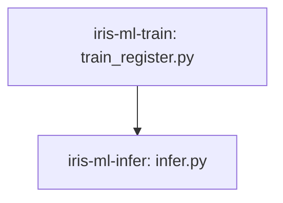

# Jobs and serving, ELI25

Short inventory of what the bundle actually declares. Lifecycle:
[eli25-mlops-lifecycle.md](eli25-mlops-lifecycle.md). How it gets to
Databricks without a surprise bill:
[eli25-databricks-productionalisation.md](eli25-databricks-productionalisation.md).

There are **two jobs** per environment and **one** serving endpoint. No extra
clusters. Train and infer are separate jobs so each can be run on its own.
The notebook `notebooks/01_train_and_register.ipynb` stays in git for
interactive use. It is not a deployed job.

## The two jobs

| Job key | File | Compute | What it runs |
|---|---|---|---|
| `iris-ml-train` | `databricks/jobs/iris_ml_train.yml` | Serverless | `train_register.py`, then register the env alias |
| `iris-ml-infer` | `databricks/jobs/iris_ml_infer.yml` | Serverless | `infer.py` against `@${var.env_suffix}` |

Deployed names are `iris-ml-train-${var.env_suffix}` and
`iris-ml-infer-${var.env_suffix}`: `iris-ml-train-develop` and
`iris-ml-infer-develop`, and the same pattern for ppe and prod. Tags are
`project: iris-ml`, `env`, `managed-by: dab`, and `owner: ${var.owner}`.

The serverless environment is `default`, client 4 (Python 3.12). `bundle deploy` runs
`uv build --wheel` and installs that wheel on the compute
(`../../dist/*.whl`). Tasks import `iris_model`. They do not pip-install
the library or add `src` to `sys.path`. `requirements-serving.txt` is the
pin file stored on the logged model for the endpoint.

## Pipeline graph

CD runs train, then infer, only when `runMode` is `train-and-serve`. The default `serve` does not start either job. Infer does not start inside the train job.

Infer fails the run if species are not `setosa` then `virginica`.

Do not `databricks bundle run` these until cost approval. `bundle validate`
is the free check.

## One endpoint per environment

`databricks/artifacts/iris_endpoint.yml` uses `iris-species-${var.env_suffix}`.
The deployed names are `iris-species-develop`, `iris-species-ppe`, and
`iris-species-prod`. Which git branch may create each one is
[Code movement](eli25-code-movement.md).

| Setting | Value |
|---|---|
| Served entity name | `iris_species` |
| UC model | `${var.registered_model_name}` for that target |
| Served version | The env alias version at CD time (`scripts/apply_served_version.py`) |
| Workload | CPU, Small |
| Scale-to-zero | on |
| Auto-capture / inference table | **off** |

CD, when someone has approved spend, deploys the endpoint for the branch
you started from (`bundle deploy -t develop` only from git `develop`, and
the same rule for `ppe` and for `prod` from `main`). A live POST is
optional and costs warm-hours:
[serving-inference-test.md](../serving-inference-test.md).

## Related

- [Databricks Asset Bundles](databricks-asset-bundles.md)
- [Cost tracker](../cost-tracker.md)
- [Teardown and restore](../teardown-and-restore.md)
