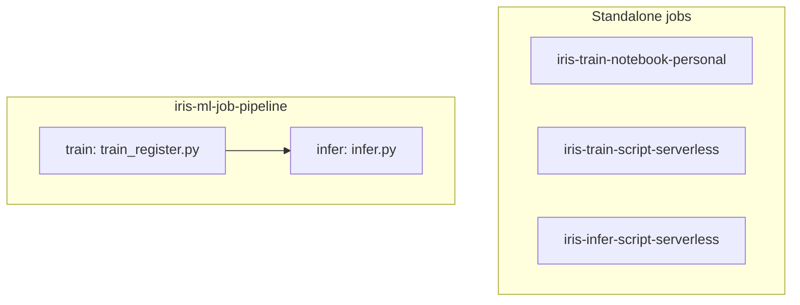

# Jobs and serving, ELI25

Short inventory of what the bundle actually declares. Lifecycle:
[eli25-mlops-lifecycle.md](eli25-mlops-lifecycle.md). How it gets to
Databricks without a surprise bill:
[eli25-databricks-productionalisation.md](eli25-databricks-productionalisation.md).

There are **four jobs** and **one** serving endpoint. No extra clusters, no
ppe/prod endpoints in git.

## The four jobs

Each `databricks/tasks/*.yml` file is one complete job. DAB will not let you
define half a job in one file and the other half in another. The pipeline
is a fourth complete job in `databricks/jobs/iris_ml_job_pipeline.yml`.

| Job name | File | Compute | What it runs |
|---|---|---|---|
| `iris-train-notebook-personal` | `databricks/tasks/train_notebook.yml` | Personal (`existing_cluster_id: ${var.personal_compute_id}`) | `notebooks/01_train_and_register.ipynb` |
| `iris-train-script-serverless` | `databricks/tasks/train_script.yml` | Serverless | `notebooks/train_register.py` with `--register` |
| `iris-infer-script-serverless` | `databricks/tasks/infer_script.yml` | Serverless | `notebooks/infer.py` against `models:/${var.registered_model_name}` |
| `iris-ml-job-pipeline` | `databricks/jobs/iris_ml_job_pipeline.yml` | Serverless | `train` then `infer` (`infer` `depends_on` `train`) |

All four are tagged `project: iris-ml`, `env: develop`, `managed-by: dab`,
`owner: ${var.owner}`. Task/compute tags differ so you can filter them in
the Jobs UI.

`personal_compute_id` defaults to empty in `databricks.yml`. Pass it at
deploy/run time. Do not paste a cluster ID into git.

Serverless jobs share environment `default` with
`../../requirements-serving.txt`.

## Pipeline graph

The first three jobs do not call each other. The pipeline is the only
train → infer chain. Infer fails the run if species are not `setosa` then
`virginica`.

Do not `databricks bundle run` these until cost approval. `bundle validate`
is the free check.

## The one endpoint

`databricks/artifacts/iris_endpoint.yml` → **`iris-species-dev`**

| Setting | Value |
|---|---|
| Served entity name | `iris_species` |
| UC model | `dbw_iris_ml_dev.develop.iris_species` |
| `entity_version` | `5` (pinned, not latest) |
| Workload | CPU, Small |
| Scale-to-zero | on |
| Auto-capture / inference table | **off** |

CD, when someone has approved spend, deploys this endpoint with the jobs
(`bundle deploy -t develop`), then `databricks serving-endpoints get iris-species-dev`.
A live POST is optional and costs warm-hours:
[serving-inference-test.md](../serving-inference-test.md).

There is no `iris-species-ppe` or `iris-species-prod` in the bundle. Those
names are future runbook steps only.

## Related

- [Databricks Asset Bundles](databricks-asset-bundles.md)
- [Cost tracker](../cost-tracker.md)
- [Teardown and restore](../teardown-and-restore.md)
