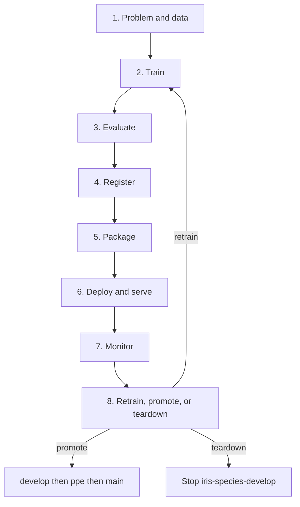
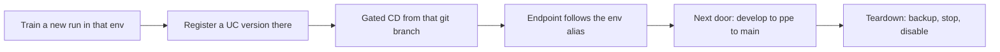
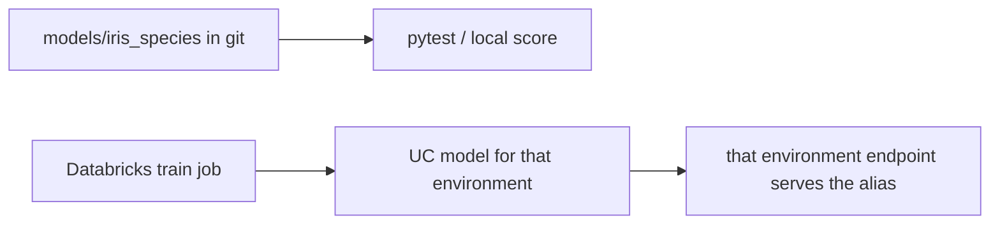

# MLOps lifecycle, ELI25

You already know how to train a model on a laptop. **MLOps** is the loop that
turns that into a versioned, callable, billable thing you can promote, retrain,
or shut off. This repo is a small iris classifier walking that loop on
Databricks, on purpose, without lighting money on fire.

You are not expected to be a Databricks expert. You should finish this page
knowing what each stage *is*, and where it already lives in this project.

How a commit moves from `develop` to `ppe` to `main`, and which Databricks
environment each branch deploys, is
[Code movement](eli25-code-movement.md).

For the bundle, jobs, CI/CD, and the $10 cap, read
[Databricks productionalisation](eli25-databricks-productionalisation.md).
For the four job names and the one endpoint, read
[Jobs and serving](eli25-jobs-and-serving.md).
For Vechtomova’s Databricks-centered frameworks (unified MLOps, 7 steps,
maturity, SRE telemetry, and her O’Reilly book / podcast #314 notes) and
what is still pending, read
[Vechtomova MLOps frameworks](eli25-vechtomova-mlops-frameworks.md).

## The loop in one picture



Local work (train, pytest, the checked-in model) is free on your machine.
Workspace work (register, job runs, `bundle deploy`) waits on cost approval.
See [cost tracker](../cost-tracker.md).

## What each stage means here

| Stage | Plain meaning | This repo |
|---|---|---|
| Problem / data | What are we predicting, from what? | 4 flower measurements → `setosa` / `versicolor` / `virginica`. Data is `sklearn.datasets.load_iris` (150 rows). Columns live in `src/iris_model/schema.py`. |
| Train | Fit a model and keep the artifact. | Local: `uv run python -m iris_model.train` writes `models/iris_species`. On Databricks: `notebooks/01_train_and_register.ipynb` or `notebooks/train_register.py`, also wired as jobs. |
| Evaluate | Prove it is not garbage. | `train_register.py` logs holdout **accuracy** to MLflow. Pytest scores the saved model and does not train. `notebooks/infer.py` fails the job unless known rows come back `setosa` then `virginica`. |
| Register | Put a numbered version on a shared shelf. | Unity Catalog name `dbw_iris_ml_dev.develop.iris_species`. Registration happens only with `--register` (or the notebook/job equivalent). |
| Package | Freeze how it runs so serving can load it. | uv package `src/iris_model`. Bundle deploy pushes the wheel onto job compute. The logged model still carries `requirements-serving.txt` for the endpoint. |
| Deploy / serve | Wake a URL that scores rows. | One endpoint per environment: `iris-species-develop`, `iris-species-ppe`, `iris-species-prod` (Small CPU, scale-to-zero). Gated CD deploys a target only from its git branch. |
| Monitor | Watch quality and the bill. | Cost snapshots, a serving POST check, the batch infer job. Inference-table auto-capture is **off** in the bundle. |
| Retrain / promote / teardown | Change the model, move environments, or go to $0. | Retrain in the environment you deploy. Promote with the steps in [Code movement](eli25-code-movement.md). Teardown is documented. |

## 1. Problem and data

The product question is boring on purpose: given sepal and petal length/width
in centimetres, name the iris species, and explain the call.

That is enough to practice a real release path (`feature/*` → `develop` →
`ppe` → `main`, and `main` deploys Databricks `prod`) without a huge dataset
or a GPU.

There is no separate feature store. The schema is the contract:
`sepal_length_cm`, `sepal_width_cm`, `petal_length_cm`, `petal_width_cm`.

## 2. Train

Training here means "fit the same RandomForest the repo already agreed on."

- **Laptop, committed artifact:** `src/iris_model/train.py` fits all 150 rows
  (`n_estimators=100`, `random_state=42`) and writes `models/iris_species`.
  Pytest loads that folder. It does not fit again. Only re-run train when you
  intend to replace the saved model and commit it.
- **Interactive notebook:** `notebooks/01_train_and_register.ipynb`. It is not
  a deployed job.
- **Train, then infer:** job `iris-ml-train` runs
  `notebooks/train_register.py` with `--register`. Job `iris-ml-infer`
  then runs `notebooks/infer.py`.

Think of the checked-in folder as the classroom copy. Databricks jobs can
create *new* Unity Catalog versions without you rewriting that folder.

## 3. Evaluate

Three checks, not three Databricks jobs:

1. **Metric while training.** `train_register.py` keeps an 80/20 split only
   for the logged `accuracy` number. The committed local model is still a
   full-data teaching fit.
2. **Contract tests on the laptop.** `uv run pytest -q` loads
   `models/iris_species` and checks the response shape (input echo, species,
   probabilities, SHAP + feature-importance narratives).
3. **Known-row batch infer.** `infer.py` scores the classic setosa and
   virginica rows and exits non-zero if the species are wrong. That is the
   evaluate step the pipeline job actually enforces after register.

No separate "eval cluster" exists. Do not invent one.

## 4. Register

Registration is putting a labeled jar on a pantry shelf other people (and
the endpoint) can point at.

- Shelf name: **Unity Catalog** `dbw_iris_ml_dev.develop.iris_species`
  (catalog.schema.model).
- MLflow experiment name: `iris-species` (on Databricks the script prefixes
  `/Users/<you>/` when needed).
- The script only registers when you pass `--register` *and* a registered
  name. The jobs pass both. A casual local `uv run` does not create version 6.

The endpoint does **not** automatically follow "latest." It is pinned to
`entity_version: "5"` in `databricks/artifacts/iris_endpoint.yml`.

## 5. Package

Two packages, not one:

- **The model package:** MLflow Pyfunc wrapper around the forest
  (`IrisPyfunc` in `src/iris_model/train.py`), with
  `requirements-serving.txt` so serving does not install the kitchen sink.
- **The workspace package:** a Databricks Asset Bundle. Root file
  `databricks.yml` only has the name, variables, and `include` lines.
  Resources live under `databricks/artifacts`, `databricks/jobs`,
  and `databricks/targets`.

`databricks bundle validate -t develop` checks the YAML. That is not deploy.
YAML details: [Asset Bundles guide](databricks-asset-bundles.md) and
[productionalisation](eli25-databricks-productionalisation.md).

## 6. Deploy and serve

Serving is a waiter with a doorbell. Someone POSTs two flower rows; the
waiter returns species plus explanations. If nobody rings for 30 minutes,
the waiter goes home (scale-to-zero).

Each environment has one endpoint: `iris-species-develop`,
`iris-species-ppe`, or `iris-species-prod`.

- Small CPU, `scale_to_zero_enabled: true`
- Serves that environment's Unity Catalog model at the alias version CD
  just trained (`@develop`, `@ppe`, or `@prod`)
- no `auto_capture_config` (legacy inference tables are rejected on create)

Which git branch may deploy which endpoint is
[Code movement](eli25-code-movement.md). Deploy stays manual, and only
after the cost sheet is approved:

```bash
databricks bundle deploy -t develop
```

Use `-t ppe` only from git branch `ppe`, and `-t prod` only from git
branch `main`. CI never runs deploy. See
[Azure DevOps guide](azure-devops.md).

## 7. Monitor

This project does not have a fancy drift dashboard. What exists:

- **Cost:** [cost tracker](../cost-tracker.md) ($10 / month cap). While the
  endpoint is warm, snapshots are a manual 30-minute habit, not a scheduled
  pipeline (schedules would burn free CI minutes).
- **Is it alive?** `databricks serving-endpoints get iris-species-develop`
  (CD does this after a develop deploy; ppe and prod use their own names).
- **Does it still know setosa?** [Serving inference test](../serving-inference-test.md)
  and `scripts/test_serving.py`. Start with `--dry-run` (no spend). Live POST
  keeps the endpoint warm.
- **Batch check:** job `iris-ml-infer`.

Auto-capture / inference tables are **off** in the current bundle, so do not
expect a Unity Catalog request log from serving until someone turns that on
and pays for payload GB. Older notes that mention an inference table are
the *intended* later shape, not what `iris_endpoint.yml` deploys today.

## 8. Retrain, promote, teardown



- **Retrain:** local `python -m iris_model.train` (commit `models/iris_species`
  if that is the source of truth you want) *or* the Databricks train task
  in the environment you deploy. Registering on the workspace does not
  rewrite the git folder.
- **Promote the served version:** CD reads the env alias and serves that
  version. Do not point the endpoint at a version that does not exist yet.
- **Promote the environment:** `feature/*` → `develop` → `ppe` → `main`.
  `main` deploys Databricks target `prod`. Steps:
  [Code movement](eli25-code-movement.md). Hosts are shared today; a
  separate workspace is the
  [promotion runbook](../runbooks/promote-ppe-prod-and-uae.md).
- **Teardown:** backup first, stop `iris-species-develop` (and the ppe or
  prod endpoint if you deployed it), disable pipelines, delete the resource
  group only if you ask for it.
  [Teardown and restore](../teardown-and-restore.md).

## Train vs register vs serve

These are three different objects. Mixing them up is how you "train
successfully" and still serve last month's model.



| Object | What it is | Who uses it |
|---|---|---|
| `models/iris_species` | Frozen MLflow folder in git | Laptop score, pytest |
| UC `iris_species` versions | Numbered registry entries, one schema per environment | Jobs and the endpoint in that environment |
| `iris-species-develop` (and ppe, prod) | HTTP endpoint for that environment | Live POST / CD verify |

## CI does not walk the whole loop

CI is the spellcheck, not the restaurant opening.

- Azure `azure-pipelines.yml`: pytest + ruff + `databricks bundle validate`. No deploy.
- CD is `azure-pipelines-cd.yml` only: manual and gated. Do not create or dispatch it until the $10 budget exists.
- GitHub Actions (`.github/workflows/ci.yml`, `cd.yml`) is disabled. Jobs are `if: false`.

Docs-only edits do not spend CI minutes. That is deliberate.

## Related

- [ELI25: Vechtomova MLOps frameworks](eli25-vechtomova-mlops-frameworks.md)
- [ELI25: Databricks productionalisation](eli25-databricks-productionalisation.md)
- [ELI25: Jobs and serving](eli25-jobs-and-serving.md)
- [Databricks Asset Bundles](databricks-asset-bundles.md)
- [Azure DevOps](azure-devops.md)
- [ADR-001 develop-only serving](../decisions/ADR-001-develop-only-serving-path.md)
- [Promotion and UAE runbook](../runbooks/promote-ppe-prod-and-uae.md)
- [Cost tracker](../cost-tracker.md)
- [Teardown and restore](../teardown-and-restore.md)
