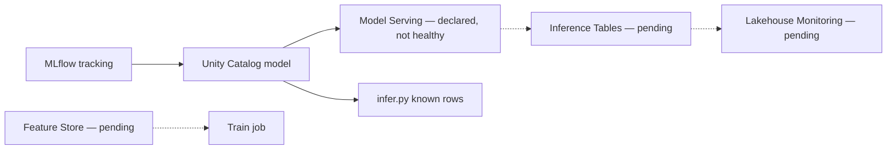
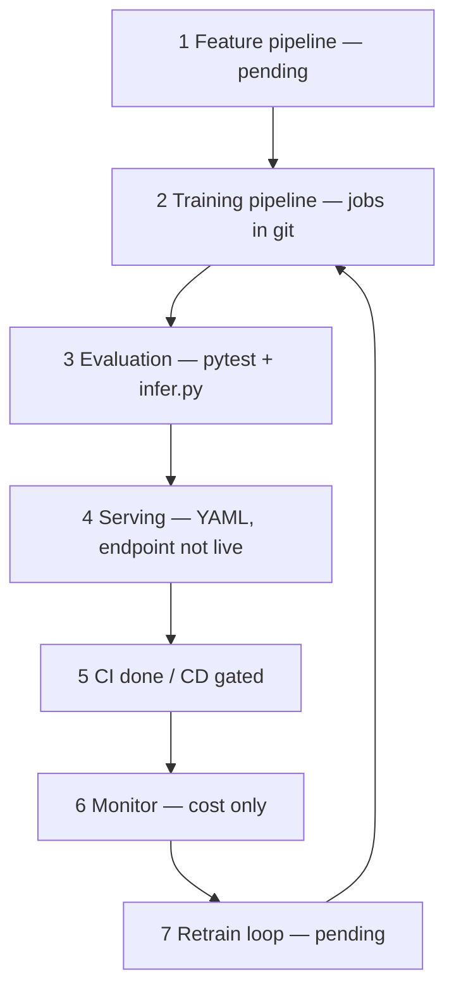
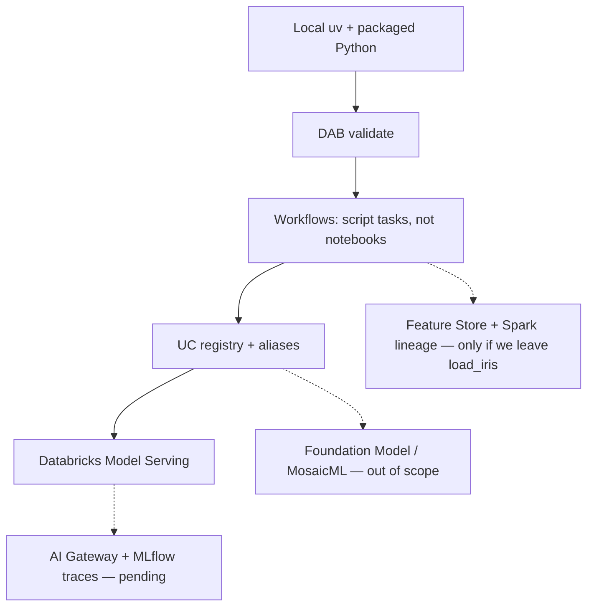

# Vechtomova MLOps frameworks, mapped to Databricks

Maria Vechtomova (*MLOps with Databricks*, Marvelous MLOps) describes
full-lifecycle frameworks. This page keeps **Databricks resources** in the
center and maps each layer to this repo. It does not adopt Airflow, K8s,
Dagger, Poetry, or Terraform as extra tools.

Companion pages: [MLOps lifecycle](eli25-mlops-lifecycle.md),
[productionalisation](eli25-databricks-productionalisation.md),
[jobs and serving](eli25-jobs-and-serving.md).

## 1. Databricks unified MLOps / LLMOps

What she covers on the Lakehouse, and the matching Databricks object here.

| Layer | Databricks resource | This repo | Status |
|---|---|---|---|
| Tracking | MLflow experiments, runs, params, metrics | `notebooks/train_register.py` logs accuracy and tags (`project`, `env`, `alias`) | **In git.** Live Databricks tracking only when a train job runs. |
| Governance | Unity Catalog model registry | `dbw_iris_ml_dev.<env>.iris_species` (or `develop` only on older branches) | **UC model exists** on develop. ppe/prod schemas and aliases are YAML, not proven live. |
| Aliases | UC `@develop` / `@ppe` / `@prod` / `Champion` | `--alias` on train; infer loads `models:/...@<env>` on `main` | **Code on `main`.** Not exercised by a successful `bundle run`. |
| Feature management | Feature Store / Feature Engineering / automatic lookup | None. Contract is `src/iris_model/schema.py` + `load_iris` | **Pending.** Teaching set has no silver feature tables. |
| Real-time serving | Model Serving endpoint (CPU, scale-to-zero) | Bundle `databricks/artifacts/iris_endpoint.yml` | **Declared.** Last deploy **failed** (`iris-species-dev` 404). |
| Batch serving | Jobs + `spark_udf` / `fe.score_batch` → gold table | `notebooks/infer.py` scores two known rows only | **Partial.** No Delta gold predictions table. |
| Observability | Inference Tables + Lakehouse Monitoring | Intentionally off (`auto_capture` removed) | **Pending.** Cost/payload gate. |
| LLMOps | MosaicML in Databricks, Foundation Model Serving, MLflow AI Gateway | Local narrative templates only (`LLM_EXPLANATION_STYLE`) | **Out of scope** (no paid LLM). See [book notes](#6-oreilly-book--podcast-314-databricks-only). |

## 2. Component / modular must-haves (Databricks substitutions)

Her enterprise layers, and what this teaching repo uses instead of a second
platform.

| Must-have | Her typical tools | Databricks resource here | Status |
|---|---|---|---|
| CI/CD as code | GitHub Actions, GitLab, Dagger | `.github/workflows/ci.yml`, `cd.yml`; `azure-pipelines.yml` | **CI done.** CD gated, not a live pipeline yet. |
| Orchestration | Airflow, Prefect, Kubeflow | **Databricks Workflows / Jobs** via DAB (`databricks/jobs`, `databricks/tasks`) | **Four jobs in git.** Pipeline is train → infer. |
| Packaging | Poetry, Docker | **uv** + `uv.lock` + `requirements-serving.txt` | **Done.** Serving pins only. |
| Compute | K8s, Docker | Personal compute job + **serverless** job environments | **Declared.** Personal cluster ID is a deploy-time `--var`. |
| IaC | Terraform, Pulumi | **Databricks Asset Bundles** (`databricks.yml`) + `infra/budget.bicep` | **Bundle done.** Budget not applied. |

Do not add Airflow or a Kubernetes cluster for iris. The Databricks job
*is* the orchestrator.

## 3. Full-stack 7-step framework (Iusztin / Decoding ML)

Vechtomova endorses this production shape. Mapped to Databricks objects
and what is still open.

| Step | Databricks resource | This repo | Pending |
|---|---|---|---|
| 1. Feature pipelines | Feature tables, Feature Views, SDP / Jobs writing silver | Schema-only; no feature job | Feature Store table, lookups, online store |
| 2. Training pipelines | Workflow notebook / Python task, MLflow | `iris-*-train-*` jobs + `iris-ml-job-pipeline` train task | Live `bundle run`; Optuna / autolog optional |
| 3. Evaluation pipelines | Separate eval job or task + UC metrics | Holdout accuracy + pytest + `infer.py` gate | Dedicated eval job, champion/challenger compare |
| 4. Deployment / serving | Model Serving + batch score job | Endpoint YAML + infer job | Healthy `develop-iris-species` (or `iris-species-dev`); gold batch table |
| 5. CI/CD | Git + DAB validate/deploy | Test-only CI; gated CD | Approve cost sheet; create/dispatch CD; pin v6 after register |
| 6. Monitoring and alerting | Inference Tables, Lakehouse Monitoring, budget alerts | Cost tracker + dry-run POST | Drift monitors, inference table, SLO alerts |
| 7. Automated retraining | Scheduled Job or table-update trigger | Manual job run only | Cron / file-arrival / metric-threshold retrain |

## 4. Maturity (Google / ml-ops.org), applied here

| Level | Meaning | This repo |
|---|---|---|
| **0 Manual** | Ad-hoc scripts, hand tracking | Local `uv run` train/score still works. That is the classroom path. |
| **1 ML pipeline automation** | Orchestrated train → register → score | **Almost.** Jobs and the train→infer graph exist in DAB. They are not a proven scheduled run. |
| **2 CI/CD automation** | Tested, gated, continuous delivery of the ML pipeline | **Shape only.** CI never deploys. CD YAML can deploy `develop` / `ppe` / `prod` after a human `YES`. No auto-retrain. |

Honest current level: **L0 complete, L1 declared, L2 sketched and gated.**
Live serving is below L1 until the endpoint exists.

## 5. Reliability and observability (SRE for ML)

Four telemetry layers she separates. Databricks names in parentheses.

| Layer | Databricks signal | This repo | Pending |
|---|---|---|---|
| Infrastructure | Job run status, cluster/serverless, endpoint `state.ready` | CD `serving-endpoints get`; Jobs UI | Endpoint READY; job success alerts |
| Code | Git SHA, bundle, `__version__` | MLflow `code_version` tag | Tie served version to a git SHA in UC |
| Data / feature | Inference Tables, feature freshness, drift monitors | Schema validation only | Inference table + Lakehouse Monitoring |
| Business | Species mix, accuracy, cost | `$10` cap + dry-run species check | SLO (e.g. accuracy ≥ X, warm-hours ≤ 35) |

**Monitoring** here today = “is the bill under $10 and did setosa still
score?” **Observability** (why it failed, across infra/code/data/business)
is not built.

## 6. O’Reilly book / podcast #314 (Databricks only)

From her MLOps Community Podcast interview (episode 314) she calls
*MLOps with Databricks* the practical “brain dump” she wanted when she
started on the platform. Below is only what maps to **Databricks
resources**. FastAPI-on-Kubernetes is in the book as a “when *not* to
use native serving” critique; this repo stays on Databricks Model
Serving.

| Book theme | Databricks resource | This repo | Status |
|---|---|---|---|
| LLMOps and MosaicML | MosaicML training/serving inside Databricks; Foundation Model APIs; pay-per-token or provisioned-throughput endpoints | No Mosaic job, no FM endpoint | **Pending / out of scope** until a paid LLM is approved. Narratives stay local templates. |
| Leave notebooks for production | Packaged Python on Jobs (`spark_python_task`), local `uv` env that matches serving pins | `src/iris_model/*`, `notebooks/train_register.py`, `notebooks/infer.py`, `uv.lock`, `requirements-serving.txt` | **Mostly done.** One teaching notebook remains for personal compute. Production path is the script jobs. |
| Local reproducible env | Same pins locally and on the serverless job environment | `uv sync --locked` + job `dependencies: requirements-serving.txt` | **Done.** Databricks does not install `uv`; it installs the compiled file. |
| DABs as IaC *and* local dev | `databricks.yml` + `databricks bundle validate` / `deploy` / `run` | Bundle under `databricks/` | **Validate done.** Deploy/run still gated; develop endpoint not healthy. |
| Advanced MLflow (LLM) | MLflow Tracing, Prompt Registry, MLflow AI Gateway (Databricks AI Gateway) | Classic tracking + UC registry only | **Pending / out of scope** for iris. No traces, no prompt versions, no gateway. |
| Feature Store limits | Feature Engineering on Databricks: feature functions + lineage | Not using Feature Store | **If added later:** expect feature functions to break on complex types; **lineage is native for PySpark, not Pandas.** Log/score with Spark or accept no FS lineage. Pandas + `schema.py` is the current workaround. |
| Custom serving architectures | Databricks Model Serving (this repo). Book also covers exporting an MLflow model off-platform | `iris_endpoint.yml` Small CPU, scale-to-zero | **Stay on Model Serving.** Do not add K8s/FastAPI. High-volume / ultra-low-latency off-platform serving is a book topic, not a repo goal. Unity Catalog stays the registry either way. |

Candid limits we already hit or will hit on Databricks:

- Legacy inference-table `auto_capture_config` was **rejected** on create.
  Newer inference tables are a later, paid switch.
- Feature Store lineage will not attach if we keep Pandas-only scoring.
- Model Serving is the only serving path here. If volume or latency ever
  outgrows Small CPU scale-to-zero, the book’s answer is “leave native
  serving”; our answer is still “stay on Databricks or stop,” not stand
  up Kubernetes.

## What we will not add just because the book lists it

These stay out unless you ask and accept the cost:

- Second orchestrator (Airflow / Prefect / Kubeflow)
- Kubernetes / Docker for serving (Model Serving is the runtime)
- Poetry (uv is the lock)
- Terraform for the workspace (DAB + one Bicep budget)
- Paid LLM gateway
- UAE North workspace (new region = new workspace)

## Next Databricks-only slice

If the goal is Vechtomova’s Databricks framework, not a new toolchain:

1. Make **one** Model Serving endpoint healthy (`develop-iris-species`).
2. Run the train job so UC aliases `@develop` + `Champion` exist.
3. Pin `entity_version` to that version.
4. Turn on **Inference Tables** only after the cost sheet lists payload GB.
5. Add **Lakehouse Monitoring** on that table (drift).
6. Add a **feature table** only if iris stops using `load_iris`.
7. Schedule the train job (step 7) only after 1–5 work.

Until 1 is true, steps 4–7 have nothing to observe.
