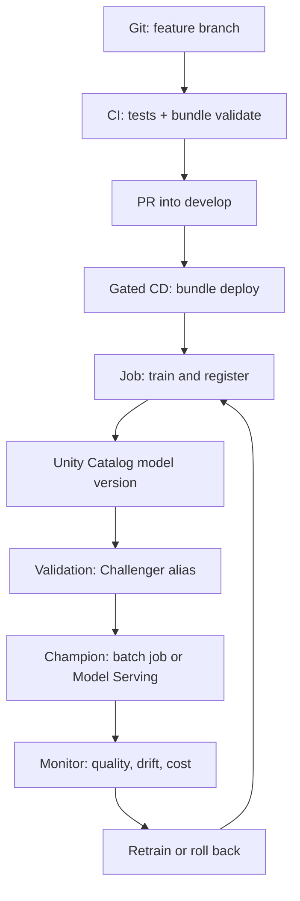

# Productionalisation of a data science / Databricks project

Productionalisation is the move from a notebook that trains once on a laptop
to a versioned system other people can run, score, promote, and shut off.
Databricks names that system **MLOps**: code, data, and models moving through
development, staging, and production with the same review path as software.

This folder is the checklist. The plain-language walkthrough of *this* iris
repo is still [ELI25: Databricks productionalisation](../guides/eli25-databricks-productionalisation.md).

## What has to exist

| Piece | What it is | Page |
|---|---|---|
| Folder structure | One git repo. Code, tests, bundle YAML, and CI live together. | [folder-structure.md](folder-structure.md) |
| Files | The concrete files a reviewer expects before a deploy is allowed. | [required-files.md](required-files.md) |
| Workflows | Train, validate, register, deploy, serve, monitor, retrain. CI never spends money. CD does, behind a human gate. | [workflows.md](workflows.md) |
| Rules | Branches, secrets, catalogs, cost, and what must not be clicked in the UI. | [rules.md](rules.md) |
| Markdown | The documents a new owner can follow without asking in chat. | [markdown-catalog.md](markdown-catalog.md) |

Databricks ships this shape as **MLOps Stacks**
(`databricks bundle init mlops-stacks`). The generated project is a
Declarative Automation Bundle (the current name for a Databricks Asset
Bundle) plus GitHub Actions or Azure DevOps. You do not have to use the
template names. You do have to cover the same jobs.

## The production loop

Databricks' rule for that loop is **deploy code, not models**. The training
job runs again in the target environment and registers a new Unity Catalog
version there. Copying a model binary from dev into prod skips the review
the code already passed. See
[MLOps workflows on Databricks](https://docs.databricks.com/aws/en/machine-learning/mlops/mlops-workflow).

## Where this iris repo stands

| Area | Status |
|---|---|
| Packaged Python (`src/iris_model`), lockfile, pytest, ruff | Present |
| Asset Bundle: jobs, tasks, develop / ppe / prod targets | Present |
| Test-only CI (GitHub + Azure DevOps) and gated CD | Present. CD deploys as a service principal per environment. The $10 budget is still proposed. |
| Unity Catalog name, aliases, served version | Train sets the alias. CD points the endpoint at that version. |
| Feature tables, dedicated validation job, inference tables, Lakehouse Monitoring, scheduled retrain | Later. Scores: [mlops-ready](../checks/mlops-ready.md), [Databricks MLOps ready](../checks/databricks-mlops-ready.md), [productionalisation ready](../checks/productionalisation-ready.md). |
| Separate workspaces per environment | Later. All three targets share one host today |

## Sources

- [MLOps workflows on Databricks](https://docs.databricks.com/aws/en/machine-learning/mlops/mlops-workflow) (development, staging, production; deploy code, not models)
- [MLOps Stacks](https://docs.databricks.com/aws/en/machine-learning/mlops/mlops-stacks) and [bundle init](https://docs.databricks.com/aws/en/dev-tools/bundles/mlops-stacks)
- Template file list: [databricks/mlops-stacks](https://github.com/databricks/mlops-stacks) `template/`
- [Developer best practices](https://docs.databricks.com/aws/en/developers/best-practices) (one repo, small bundles, one bundle per lifecycle, dedicated deploy path)
- [Models in Unity Catalog](https://docs.databricks.com/aws/en/machine-learning/manage-model-lifecycle/) (aliases, no stages)
