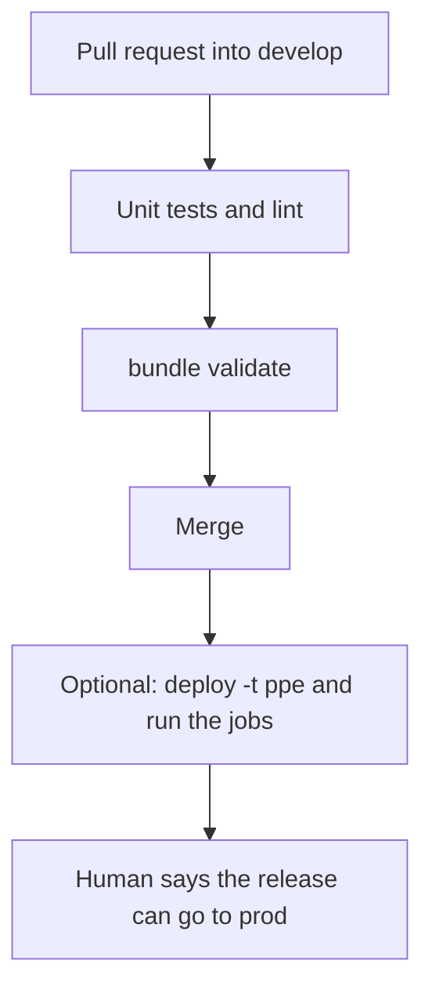
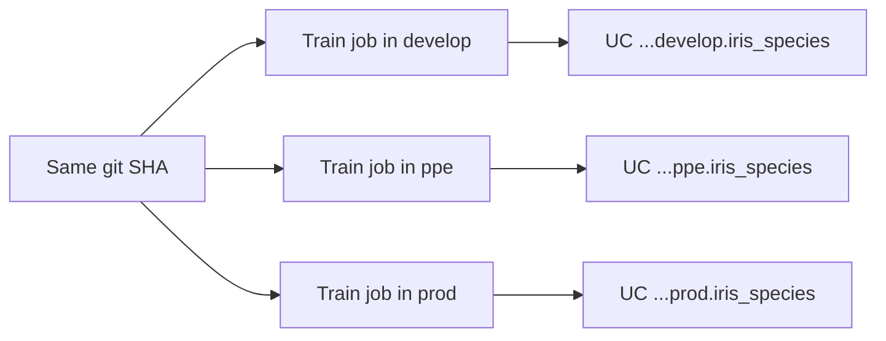

# Workflows

Databricks splits MLOps into three execution environments: **development**,
**staging**, and **production**. Each one has its own compute, its own
catalog, and a defined door into the next. The write-up is
[MLOps workflows on Databricks](https://docs.databricks.com/aws/en/machine-learning/mlops/mlops-workflow).

This repo uses the same three doors with the names `develop`, `ppe`, and
`prod`. All three bundle targets currently point at one workspace host.
Catalog schemas differ (`dbw_iris_ml_dev.develop`, `.ppe`, `.prod`). Separate
workspaces are the stronger isolation Databricks recommends, and they are
the later step in the [promotion runbook](../runbooks/promote-ppe-prod-and-uae.md).

## 1. Development

Someone on a feature branch explores data, writes the training code, and
proves a model can be registered.

| Step | Databricks expectation | This repo |
|---|---|---|
| Data | Read-write on the dev catalog. Read-only on prod data when policy allows | `sklearn.datasets.load_iris` inside the training code. No bronze/silver tables yet |
| EDA | Notebooks. Not deployed | `notebooks/01_train_and_register.ipynb` on personal compute |
| Code | A git repo from the first experiment, not after the model "works" | `src/iris_model/` |
| Train | A job: fit, log params/metrics/model to MLflow, register into the dev catalog | train task of `iris-ml-job-pipeline` |
| Evaluate | Held-out metric logged on the run. Compare with the current Champion when one exists | Holdout accuracy in `notebooks/train_register.py`. Pytest checks the local artifact |
| Validate | A task that loads the new version and either stops or sets the `Challenger` alias | Known-row check in `notebooks/infer.py` (setosa, then virginica) |
| Commit | Feature branch, then a pull request | `feature/*` into `develop` |

Local `uv run python -m iris_model.train` writes `models/iris_species` for
pytest. That folder is the classroom copy. A Databricks train job with
`--register` writes a new Unity Catalog version and does not rewrite git.

## 2. Staging (pull request and pre-production)

Staging answers "does the pipeline still run," not "is the idea interesting."



| Check | Where it runs here | Spends money? |
|---|---|---|
| `uv sync --locked`, pytest, ruff | `.github/workflows/ci.yml` on PRs and pushes to `develop` | No |
| Same tests plus `databricks bundle validate` | `azure-pipelines.yml` | No. Validate reads YAML; it does not create jobs |
| Docs-only edits | Path filters skip CI | No |
| Integration: train job, then infer job, against the staging catalog | Not automatic. A human runs the job after a gated deploy | Yes. Serverless job time |
| Staging endpoint smoke | CD dry-run, then an explicit POST | A live POST keeps a Small CPU endpoint warm |

MLOps Stacks makes the staging deploy a workflow
(`<project>-bundle-cd-staging.yml`) that runs after CI is green. This repo
keeps that step manual: CD `workflow_dispatch` or `azure-pipelines-cd.yml`
with `trigger: none`, and the caller must type `YES` because the
[$10 budget](../cost-tracker.md) is the approval.

Do not put `bundle deploy` in the test workflow. A red test should be free.

## 3. Production

After the release is accepted, production runs the same code on production
data and serves the alias, not a file someone copied.

| Step | What happens | This repo today |
|---|---|---|
| Train | Scheduled or triggered job. Logs to the prod MLflow experiment. Registers `prod.<schema>.<model>` | Target `prod` is declared. Dispatch is gated. No schedule |
| Validate | Format, metadata, slice metrics, required tags. Pass sets `Challenger`. Fail notifies and stops | Infer task fails the job on the wrong species. No alias-update task yet |
| Compare | Challenger versus Champion on a held-out set, or a live traffic split | Not built. First version can be compared to a fixed accuracy floor |
| Deploy batch | Inference job loads `models:/<name>@Champion` | Infer job is wired to the env alias / registered name |
| Deploy HTTP | Model Serving update. The old config stays until the new one is ready | `databricks/artifacts/iris_endpoint.yml`: CPU, Small, scale-to-zero, `entity_version` pinned |
| Monitor | Inference table or job output → drift and accuracy metrics → alert | Cost snapshots and a manual serving check. Inference capture is off |
| Retrain | Start with a schedule. Move to a metric alert only after the monitor is real | Manual job run |

Serving config in this repo:

- workload CPU, size Small
- `scale_to_zero_enabled: true` (idle after about 30 minutes with no requests)
- served version is the env alias version at CD time, not "latest" and not a leftover pin from the day the endpoint was created
- no `auto_capture_config` (the legacy inference-table field is rejected on create, and payload logging is a cost line)

Batch scoring is the cheaper path when latency can be minutes. HTTP serving
is for a caller that needs a row back now. This project has both: the infer
job and one endpoint.

## Deploy code, not the model binary



Each environment registers its own version. The endpoint or batch job in
that environment loads its own catalog. Promoting "the weights" from
develop to prod is the exception (air-gapped data, or a model that is too
expensive to refit), and it should be an ADR when you choose it.

This teaching repo also keeps `models/iris_species` in git so laptop tests
have a frozen artifact. That does not change the workspace rule: the
endpoint serves the Unity Catalog version named in the target, not the git
folder.

## CI and CD files in this repo

| Workflow | Trigger | Result |
|---|---|---|
| `.github/workflows/ci.yml` | PR or push to `develop`, path-filtered | pytest and ruff. Concurrency cancels older runs. No schedule |
| `azure-pipelines.yml` | PRs into `develop`, and pushes to `develop`, `ppe`, and `prod` | pytest, ruff, `bundle validate -t develop`, `-t ppe`, and `-t prod` |
| `.github/workflows/cd.yml` | `workflow_dispatch` only. Input `confirm=YES`. Choice of `develop`, `ppe`, or `prod` | Deploy that target |
| `azure-pipelines-cd.yml` | `trigger: none`, `pr: none`. Environment `iris-develop` | Same deploy, Azure side |

Create or run either CD workflow only after [cost-tracker.md](../cost-tracker.md)
is approved and the budget in `infra/budget.bicep` exists. The smoke step
is a dry run. A live score is [serving-inference-test.md](../serving-inference-test.md).

Safe command, from the repo root, after the Databricks CLI is authenticated:

```bash
databricks bundle validate -t develop
```

Paid command, after that approval:

```bash
databricks bundle deploy -t develop
```

`bundle deploy` updates jobs (and, on the CD path, the endpoint). It does
not create the resource group, the workspace, or the catalog.

## Operator workflows that are not the model loop

| Workflow | Document | When |
|---|---|---|
| Promote ppe and prod, or open a new region | [promote-ppe-prod-and-uae.md](../runbooks/promote-ppe-prod-and-uae.md) | A second environment is actually wanted. A new region means a new workspace |
| Stop spend | [teardown-and-restore.md](../teardown-and-restore.md) | Order is backup, stop the endpoint, disable pipelines, delete the resource group only with an extra confirm |
| Change training code | [markdown catalog](markdown-catalog.md) points at the MLOps Stacks equivalent `docs/ml-pull-request.md` | Any PR that changes fit, features, or the served contract |

## What "done" means for a workflow

A workflow is productionalised when all of these are true:

1. The steps are YAML or Python in git, not clicks that only exist in a workspace.
2. A pull request runs the tests before merge.
3. Deploy is a separate, permissioned pipeline.
4. The model version that is served is either an alias (`Champion`) or an explicit pin, and the git SHA that trained it is a tag on the run.
5. Failure of train blocks infer. Failure of validation blocks the alias move.
6. Someone who was not in the room can redeploy from the runbook.
